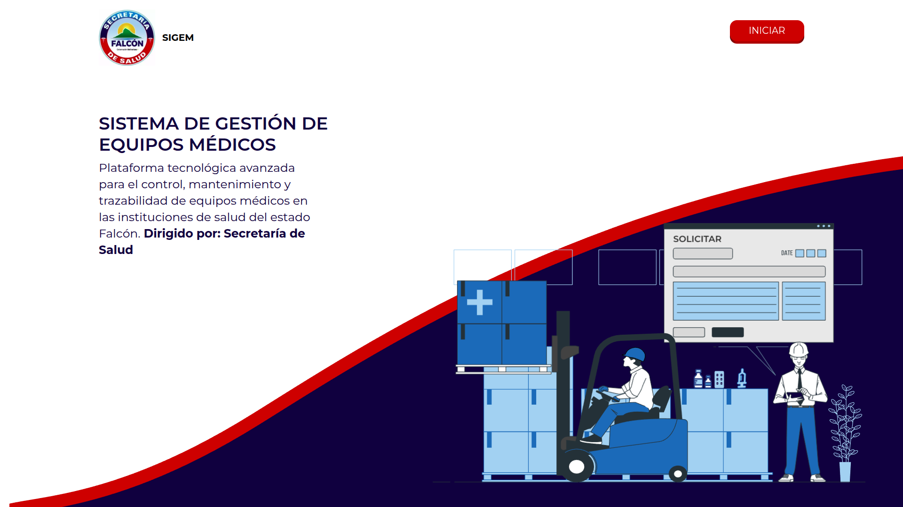

# SIGEM 

Web application for Inventory Machine management of Secretaria de Salud (Laravel + React -- Project from [][SISMED](https://github.com/JDonquis/SISMED) )

## Installation

Use the dependency manager [Composer](https://getcomposer.org/) to install Laravel.

```bash
git clone https://github.com/juanvillans/SIGEM.git
```

```bash
cd larave
cp .env.example .env
composer install
```
Set values of PostgreSQL database on .env file and then:

```bash
php artisan migrate --seed
```

```bash
php artisan serve
```

Create a new terminal window and activate react:

```bash
cd react
npm install
npm run dev
```

## **Tools**  
- Laravel 10  
- React  
- Tailwind CSS 


  

## **Get in touch**  
[juanvillans16@gmail.com](mailto:juanvillans16@email.com)  

[juandonquis07@gmail.com](mailto:juandonquis07@email.com)


## License

Copyright (c) Secretaria de Salud. All rights reserved.